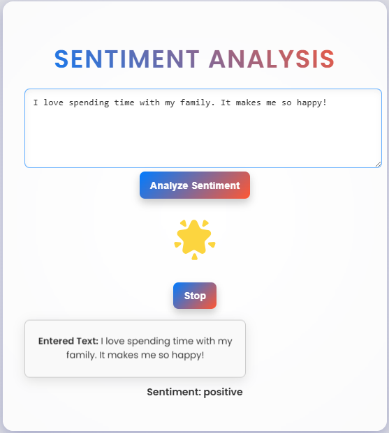

# Sentiment Analysis Web App

This web application uses a pre-trained machine learning model to perform sentiment analysis on text input. It classifies text as **positive**, **neutral**, or **negative**, and provides visual feedback with emojis. Additionally, there's an interactive "blinking emoji" effect that corresponds to the sentiment of the text entered.

## Features

- **Sentiment Analysis**: Classifies the sentiment of the text as **positive**, **negative**, or **neutral**.
- **Interactive Emoji Blinker**: Based on the sentiment, an emoji blinks at a speed determined by user actions.
- **Simple and Responsive UI**: Clean, modern design with a user-friendly experience.

## Technologies Used

- **Python** (Flask) for the back-end web framework
- **Torch** and **Transformers** for sentiment analysis using a pre-trained Roberta model
- **HTML/CSS** for front-end design and user interface
- **JavaScript** for emoji blinking effect functionality

## How to Run the App

### Requirements

- Python 3.x
- Flask
- PyTorch
- Transformers

### Installation Steps

1. **Clone the Repository:**

    ```bash
    git clone https://github.com/your-username/sentiment-analysis-webapp.git
    cd sentiment-analysis-webapp
    ```

2. **Install the Required Packages:**

    You can install the required dependencies using pip:

    ```bash
    pip install -r requirements.txt
    ```

    _If `requirements.txt` doesn't exist, you can install the necessary packages with the following commands:_

    ```bash
    pip install Flask torch transformers
    ```

3. **Run the Application:**

    Inside the project folder, run the following command:

    ```bash
    python app.py
    ```

    The application will run on `http://127.0.0.1:5000/`.

4. **Visit the Website:**

    Open your browser and visit `http://127.0.0.1:5000/` to use the sentiment analysis tool.

## Example

- Input Text: *"I had a great day at the park!"*
- Result: **Sentiment**: Positive, Emoji: 😎, Blinking Emoji will be displayed.

## File Structure

- `app.py`: The Flask back-end server code that runs the application.
- `templates/index.html`: The main HTML structure for the sentiment analysis web app.
- `static/style.css`: The CSS file that styles the webpage and gives it a modern look.
- `static/emoji.js`: The JavaScript code to handle emoji blinking.

## Contributing

1. Fork this repository.
2. Create a new branch (`git checkout -b feature-name`).
3. Commit your changes (`git commit -am 'Add feature'`).
4. Push to the branch (`git push origin feature-name`).
5. Create a new Pull Request.

## License

This project is open source and available under the [MIT License](LICENSE).

---
